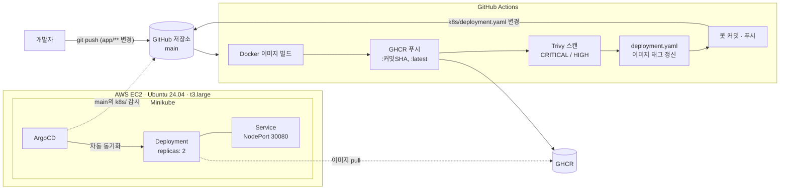

# aws-k8s-cloud-platform-devsecops

[](https://github.com/sungjin-kim1994/aws-k8s-cloud-platform-devsecops/actions/workflows/ci-cd.yml)

`app/` 코드를 `main`에 푸시하면 **이미지 빌드 → 레지스트리 푸시 → 취약점 스캔 → 배포 매니페스트 갱신 → Kubernetes 반영**까지 사람 손을 거치지 않고 이어지는 DevSecOps 파이프라인입니다. AWS EC2 위 단일 노드 Kubernetes(Minikube)에 GitHub Actions(CI)와 ArgoCD(GitOps CD)를 연결했습니다.

> 학습·포트폴리오 목적의 단일 노드 환경입니다. 비용 관리를 위해 EC2는 사용하지 않을 때 정지(Stop)해 두므로 상시 접속 가능한 데모 주소는 없습니다. 운영 환경과의 차이는 [9. 현재 한계와 개선 계획](#9-현재-한계와-개선-계획)에 정리했습니다.

## 1. 한눈에 보기

| 항목 | 내용 |
| --- | --- |
| 애플리케이션 | 도서 검색 API를 가정한 Flask 샘플 앱 (`/`, `/health`, `/books`) |
| 컨테이너 | `python:3.11-slim` 기반 Docker 이미지 |
| 레지스트리 | GitHub Container Registry (GHCR) |
| CI | GitHub Actions — 빌드·푸시·Trivy 스캔·매니페스트 이미지 태그 갱신 |
| CD | ArgoCD — `main` 브랜치의 `k8s/`를 자동 동기화 (`prune`, `selfHeal`) |
| 런타임 | AWS EC2 (Ubuntu 24.04, t3.large) 위 Minikube — Deployment 2 replicas + NodePort Service |
| 보안 | Trivy 이미지 스캔(CRITICAL/HIGH), 잡 단위 최소 권한 토큰, 커밋 SHA 이미지 태그 |

## 2. 아키텍처



1. `app/` 아래 코드가 `main`에 푸시되면 워크플로우가 시작됩니다 (`paths: app/**`).
2. 이미지를 빌드해 GHCR에 `:<커밋 SHA>`와 `:latest` 두 태그로 푸시합니다.
3. Trivy가 방금 푸시한 SHA 태그 이미지를 CRITICAL/HIGH 기준으로 스캔합니다.
4. `k8s/deployment.yaml`의 이미지 태그를 해당 SHA로 바꾸고 `github-actions[bot]`이 커밋·푸시합니다.
5. ArgoCD가 `main`의 `k8s/`와 클러스터 상태를 비교해 차이를 반영하고, Deployment가 새 이미지로 파드를 교체합니다.

## 3. 저장소 구조

```
.
├── app/
│   ├── app.py              # Flask API (/, /health, /books)
│   ├── requirements.txt    # flask==3.0.0
│   └── Dockerfile          # python:3.11-slim, 의존성 레이어를 먼저 복사해 빌드 캐시 활용
├── k8s/
│   └── deployment.yaml     # Deployment(replicas 2) + Service(NodePort 30080), CI가 이미지 태그를 갱신
├── .github/workflows/
│   └── ci-cd.yml           # CI 파이프라인
└── argocd-app.yaml         # ArgoCD Application (최초 1회 kubectl apply)
```

## 4. 파이프라인 상세

### 4-1. CI — `.github/workflows/ci-cd.yml`

| 순서 | 스텝 (사용 액션) | 역할 |
| --- | --- | --- |
| 1 | 코드 체크아웃<br>`actions/checkout@v4` | 저장소 코드를 러너로 가져옴 |
| 2 | GHCR 로그인<br>`docker/login-action@v3` | `secrets.GITHUB_TOKEN`으로 인증 (별도 PAT 불필요) |
| 3 | Buildx 설정<br>`docker/setup-buildx-action@v3` | 빌드 환경 준비 |
| 4 | 이미지 빌드·푸시<br>`docker/build-push-action@v5` | `app/`을 빌드해 `:SHA`, `:latest`로 푸시 |
| 5 | Trivy 스캔<br>`aquasecurity/trivy-action@master` | CRITICAL/HIGH 리포트 (`exit-code: 0`, 리포트 전용) |
| 6 | 태그 갱신<br>`sed` | `deployment.yaml`의 이미지 태그를 SHA로 교체 |
| 7 | 매니페스트 커밋·푸시<br>`git` | 변경 시에만 `[skip ci]` 커밋 후 푸시 |

설계 포인트

- **이미지 태그 전략**: 매니페스트에는 가변 태그 `latest` 대신 커밋 SHA 태그를 기록합니다. 클러스터에서 도는 이미지가 어느 커밋에서 나왔는지 바로 추적되고, 이전 SHA로 되돌리기도 쉽습니다.
- **무한 루프 방지**: 봇 커밋은 `k8s/`만 바꾸므로 `paths: app/**` 필터에 걸리지 않고, 메시지에 `[skip ci]`도 붙습니다. 여기에 더해 `GITHUB_TOKEN`으로 만든 푸시는 새 워크플로우 실행을 만들지 않는 GitHub의 동작 방식이 있어 세 겹으로 막혀 있습니다.
- **권한 최소화**: 잡에는 `contents: write`(매니페스트 커밋)와 `packages: write`(GHCR 푸시)만 부여했습니다.
- **빈 커밋 방지**: `git diff --staged --quiet || git commit ...` — 태그가 이미 같으면 커밋하지 않고, 스텝도 실패하지 않습니다.

### 4-2. CD — `argocd-app.yaml`

| 설정 | 값 | 의미 |
| --- | --- | --- |
| `source` | 이 저장소 / `main` / `k8s` | 감시 대상: `main` 브랜치의 `k8s/` 디렉터리 |
| `destination.server` | `https://kubernetes.default.svc` | ArgoCD가 설치된 같은 클러스터 |
| `destination.namespace` | `default` | 배포 네임스페이스 |
| `syncPolicy.automated` | 활성 | Git과 클러스터가 다르면 사람 승인 없이 동기화 |
| `prune` | `true` | Git에서 지운 리소스는 클러스터에서도 삭제 |
| `selfHeal` | `true` | 클러스터를 수동으로 바꿔도 Git 상태로 되돌림 |

`argocd-app.yaml`은 부트스트랩용으로 최초 1회만 `kubectl apply` 합니다. 그 뒤 애플리케이션 배포는 `kubectl apply` 없이 Git 커밋만으로 반영됩니다.

### 4-3. Kubernetes 리소스 — `k8s/deployment.yaml`

- **Deployment `devsecops-app`**: `replicas: 2`. 파드 하나가 죽어도 나머지가 요청을 처리하고, 이미지가 바뀌면 기본 RollingUpdate 전략으로 순차 교체합니다.
- **`imagePullPolicy: Always`**: Kubernetes 배포 단계(`07e1619`)에서는 Minikube 내부에서 직접 빌드한 로컬 이미지(`devsecops-app:v1`)를 쓰느라 `Never`였고, 이미지를 GHCR로 옮기면서(`7f0336a`) `Always`로 바꿨습니다.
- **Service `devsecops-app-service`**: NodePort `30080` → 컨테이너 포트 `5000`. Deployment와 같은 파일에 `---`로 구분해 두었습니다.

## 5. 보안 관점에서 적용한 것

| 리스크 | 적용한 통제 |
| --- | --- |
| 알려진 취약점이 있는 패키지를 포함한 이미지 배포 | 빌드마다 Trivy로 OS 패키지와 Python 의존성 스캔 (CRITICAL/HIGH) — 현재는 리포트 전용, [9장](#9-현재-한계와-개선-계획) 참고 |
| CI 자격증명 유출 | 장기 PAT 대신 잡 단위 `GITHUB_TOKEN`, 권한은 2개로 제한 |
| 배포 이미지의 출처 불명확 | SHA 태그 + 봇 커밋 이력으로 언제·어떤 커밋의 이미지로 바뀌었는지 Git에 남음 |
| 클러스터 수동 변경(drift) | ArgoCD `selfHeal`로 Git 상태 강제 |
| SSH 무차별 대입 | EC2 보안 그룹의 SSH(22) 소스를 본인 IP로 제한 |

Trivy는 공개 취약점 DB(NVD, OS 벤더 보안 공지, GitHub Advisory 등)와 이미지 안 패키지 버전을 대조하는 정적 분석입니다. 보안관제에서 다루던 IPS/IDS처럼 행위나 트래픽을 보는 탐지가 아니라, 배포 전에 알려진 취약점을 걸러내는 예방 통제입니다. 런타임 탐지는 별도 계층이 필요합니다.

## 6. 동작 검증

### 엔드포인트

```bash
curl http://$(minikube ip):30080/
# {"message":"DevSecOps Platform - Book Search API","status":"running"}
curl http://$(minikube ip):30080/health
# {"status":"healthy"}
curl http://$(minikube ip):30080/books
```

### 파이프라인 end-to-end

| 커밋 | 작성자 | 내용 |
| --- | --- | --- |
| `72e6d5c` | sungjin-kim1994 | `app/app.py` 주석 수정 (CI 트리거용) |
| `72ecaf0` | github-actions[bot] | `k8s/deployment.yaml` 이미지 태그를 `72e6d5c…`로 갱신 |

봇 커밋 이후 수동 `kubectl apply` 없이, 실행 중인 파드의 이미지가 해당 SHA 태그로 바뀐 것을 확인했습니다.

```bash
git pull && git log --oneline -3                 # 봇 커밋 72ecaf0 확인
kubectl get pods -l app=devsecops-app \
  -o jsonpath='{.items[*].spec.containers[*].image}'
# ghcr.io/sungjin-kim1994/devsecops-app:72e6d5c30d3d8887bbbcae3d1e997b0c05251455
```

## 7. 재현 방법

검증 환경: AWS EC2 t3.large (2 vCPU / 8 GiB, 메모리 여유를 위해 선택), Ubuntu 24.04, EBS 30 GiB, Docker · kubectl · Minikube 설치.

```bash
# 0) 저장소 받기
git clone https://github.com/sungjin-kim1994/aws-k8s-cloud-platform-devsecops.git
cd aws-k8s-cloud-platform-devsecops

# 1) 클러스터 시작
minikube start --driver=docker

# 2) ArgoCD 설치 (공식 문서 방식)
kubectl create namespace argocd
kubectl apply -n argocd --server-side --force-conflicts \
  -f https://raw.githubusercontent.com/argoproj/argo-cd/stable/manifests/install.yaml
kubectl get pods -n argocd                        # 모든 파드가 Running인지 확인

# 3) Application 등록 — 이후 배포는 ArgoCD가 수행
kubectl apply -f argocd-app.yaml
kubectl get application devsecops-app -n argocd   # SYNC STATUS: Synced / HEALTH STATUS: Healthy

# 4) 확인
kubectl get pods -l app=devsecops-app
curl http://$(minikube ip):30080/health
```

ArgoCD UI (선택) — 보안 그룹에 포트를 추가로 열지 않도록 SSH 터널로 접속합니다.

```bash
# EC2 안에서: 초기 admin 비밀번호 확인 후 포트 포워딩
kubectl -n argocd get secret argocd-initial-admin-secret \
  -o jsonpath="{.data.password}" | base64 -d; echo
kubectl port-forward svc/argocd-server -n argocd 8080:443

# 내 PC에서: SSH 터널 연결 후 브라우저로 https://localhost:8080 (ID: admin)
ssh -i <키 파일>.pem -L 8080:localhost:8080 ubuntu@<EC2 퍼블릭 IP>
```

포크해서 사용할 경우: `ci-cd.yml`, `k8s/deployment.yaml`, `argocd-app.yaml`에 계정명(`sungjin-kim1994`)이 고정되어 있어 본인 계정으로 바꿔야 합니다. GHCR 패키지는 Public으로 두거나, Private이면 클러스터에 `imagePullSecrets`를 설정해야 합니다.

## 8. 트러블슈팅 기록

| 증상 | 원인 | 해결 |
| --- | --- | --- |
| `git push` 거부: `refusing to allow a Personal Access Token to create or update workflow ... without workflow scope` | `.github/workflows/` 파일을 푸시하려면 PAT에 `repo` 외에 `workflow` 스코프가 따로 필요 | 기존 classic PAT에 `workflow` 스코프 추가 (토큰 문자열은 그대로 유지됨) |
| 워크플로우 파일만 수정해 푸시했는데 Actions 실행 0건 | `paths: app/**` 필터에 걸리지 않음 — 의도된 동작 | `app/` 변경으로 트리거 확인. 부작용으로 CI 설정 변경 자체는 검증되지 않으므로 9장에 개선안 기재 |
| ArgoCD 설치 시 `metadata.annotations: Too long: may not be more than 262144 bytes` | client-side apply는 적용한 매니페스트 전체를 `last-applied-configuration` 어노테이션에 저장하는데, ArgoCD CRD가 이 크기 제한을 넘음 | `--server-side`로 전환 — API 서버가 필드 단위로 소유권을 관리 |
| 위 재시도에서 필드 소유권 충돌 | 첫 client-side 시도에서 일부 필드의 관리 주체가 이미 기록됨 | `--force-conflicts` ([공식 설치 문서](https://argo-cd.readthedocs.io/en/stable/getting_started/)도 두 플래그를 함께 사용). 운영 환경이라면 강제 적용 전에 `managedFields`로 소유자 확인, `--dry-run=server`로 영향 확인, 한 리소스는 한 도구만 관리하도록 정리 |
| EC2 재시작 후 `kubectl` 명령이 `no route to host` | EC2를 Stop/Start하면 Minikube 클러스터는 자동으로 다시 뜨지 않음 | `minikube status` 확인 후 `minikube start` |
| `curl localhost:30080` 실패 | Minikube(docker 드라이버)는 노드 자체가 별도 컨테이너라 NodePort가 EC2의 localhost가 아닌 노드 IP에 열림 | `curl $(minikube ip):30080` |
| 봇 커밋이 로컬 `git log`에 안 보임 | 로컬 브랜치가 원격보다 뒤처져 있음 | `git pull` (`fetch`는 원격 이력만 가져오고, `pull`은 로컬 브랜치에 병합까지 수행) |

## 9. 현재 한계와 개선 계획

| 항목 | 현재 상태와 위험 | 개선 계획 |
| --- | --- | --- |
| 스캔이 배포를 막지 못함 | `exit-code: 0`이고 푸시 **후** 스캔하므로, 취약한 이미지도 레지스트리에 올라가고 매니페스트까지 갱신됨 | 빌드(로컬 로드) → 스캔(`exit-code: 1`, CRITICAL 기준) → 통과 시에만 푸시·태그 갱신. 예외는 `.trivyignore`에 사유와 함께 관리 |
| 가변 참조로 액션 사용 | `aquasecurity/trivy-action@master`. 2026년 3월 trivy-action의 버전 태그 76개가 악성 커밋으로 강제 푸시되어 CI 시크릿을 탈취한 [공급망 공격](https://github.com/aquasecurity/trivy/security/advisories/GHSA-69fq-xp46-6x23)이 있었음 (이 프로젝트의 실행 시점은 이후라 해당 없음). 이 잡의 토큰은 저장소·패키지 쓰기 권한이 있어 같은 일이 생기면 영향이 큼 | 모든 서드파티 액션을 전체 커밋 SHA로 고정 (예: trivy-action v0.36.0 → `ed142fd0673e97e23eac54620cfb913e5ce36c25`), Dependabot으로 갱신 관리 |
| 컨테이너가 root로 실행 | Dockerfile에 `USER`가 없고 파드 `securityContext`도 없음 | 비root 사용자 추가, `runAsNonRoot`, `readOnlyRootFilesystem`, `allowPrivilegeEscalation: false` |
| 헬스체크·리소스 제한 없음 | `/health`가 있지만 probe에 연결하지 않았고 requests/limits도 없음 → 앱이 멈춰도 트래픽을 계속 받고, 자원 독점 가능 | `readinessProbe`/`livenessProbe`를 `/health`에 연결, requests/limits 지정 |
| 개발용 웹 서버 | Flask 내장 서버(`app.run`)로 실행 | gunicorn 등 WSGI 서버로 교체 |
| CI 설정 변경이 검증되지 않음 | `paths: app/**` 때문에 워크플로우만 바꾸면 실행되지 않음 | `workflow_dispatch` 추가, 또는 `paths`에 `.github/workflows/**` 포함 |
| 봇이 `main`에 직접 푸시 | 배포 매니페스트 변경이 리뷰 없이 반영되고, 앱 코드와 배포 설정이 한 저장소·한 브랜치에 섞임 | 매니페스트 전용 저장소 분리 또는 PR 기반 환경 승격(dev → prod) |
| 계정명 하드코딩 | `ci-cd.yml`, `argocd-app.yaml`에 계정명 고정 | `${{ github.repository_owner }}` 등으로 변수화 (GHCR 경로는 소문자 필요) |
| 인프라 수동 구성 | EC2·보안 그룹을 콘솔에서 생성, 기본 VPC 사용 → 재현성과 변경 이력 부족 | Terraform으로 VPC(퍼블릭/프라이빗 서브넷)·EC2·보안 그룹 코드화 |
| 단일 노드 | Minikube 단일 노드라 노드 장애가 곧 서비스 장애 | EKS 등 관리형 멀티 노드 클러스터, Ingress/LoadBalancer |
| 관측성 없음 | 로그·메트릭 수집이 없어 장애 인지가 늦음 | Prometheus + Grafana, ArgoCD 동기화 실패 알림 |

## 10. 작업 이력

실제 커밋 시각(KST) 기준입니다. 커밋 메시지의 `Day` 표기는 작업 단계 구분용이며, `Day3`과 `Day4`는 같은 날 약 2시간 반 간격으로 진행했습니다.

| 커밋 시각 (KST) | 커밋 | 내용 |
| --- | --- | --- |
| 2026-09-25 17:25 | `a713d2f` | Flask 앱 Docker 컨테이너화 |
| 2026-09-26 06:56 | `07e1619` | Kubernetes 배포 (Deployment 2 replicas + NodePort Service) |
| 2026-09-27 00:53 | `7f0336a` | GitHub Actions 파이프라인 추가 (GHCR 빌드·푸시, 매니페스트 자동 갱신), 이미지를 GHCR로 전환 |
| 2026-09-27 01:08 | `481b7ea` → `3b94d9a` | 파이프라인 트리거 테스트 → 봇 이미지 태그 갱신 |
| 2026-09-27 03:19 | `17a3a3d` | Trivy 스캔 스텝 추가, ArgoCD Application 매니페스트 추가 |
| 2026-09-27 03:31 | `72e6d5c` → `72ecaf0` | Trivy 포함 파이프라인 end-to-end 확인 → 봇 이미지 태그 갱신 |

## 11. 배운 점

- **에러 메시지를 원인 단위까지 따라가기**: `262144 bytes` 오류를 플래그 하나로 넘기지 않고, client-side apply가 설정을 어노테이션에 저장하는 방식 → server-side apply의 필드 소유권 모델까지 이해하고 나서 `--force-conflicts`의 의미와 운영 환경에서의 대안을 정리했습니다.
- **"자동화됐다"를 증거로 확인하기**: 대시보드의 Synced 표시에서 멈추지 않고, 봇 커밋의 SHA와 실제 실행 중인 파드의 이미지 태그를 직접 대조했습니다.
- **보안 도구도 공급망의 일부**: 취약점 스캐너 액션을 가변 참조로 쓰는 것 자체가 위험이 될 수 있다는 점을 한계로 기록하고, SHA 고정을 다음 개선 과제로 두었습니다.
